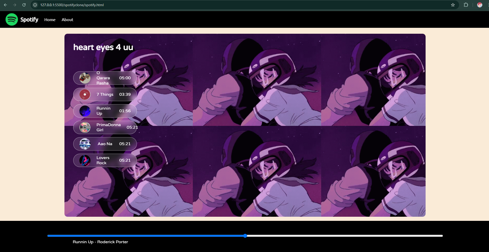

# Spotify Clone 🎵

A simple clone of the Spotify web application built using HTML, CSS, and JavaScript.
This project is a front-end only implementation that mimics the look and feel of Spotify's web interface.

## Demo

## Features

- Responsive design that adapts to different screen sizes.
- Navigation bar with links to Home and About.
- Custom player controls for play, pause and next.
- Music player interface with album artwork, song title, artist name, and playback controls.

## Technologies Used

- **HTML**: Structure of the web pages.
- **CSS**: Styling and layout of the web pages.
- **JavaScript**: Interactivity.
